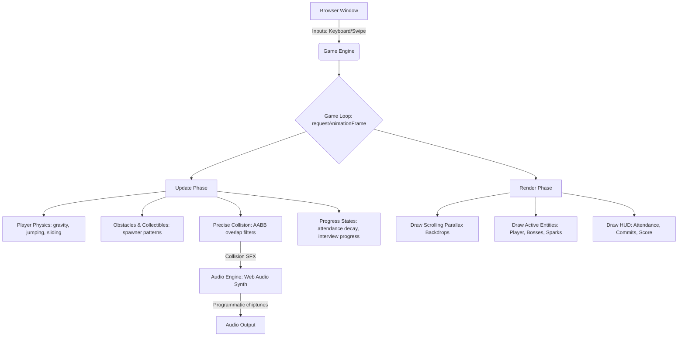

# Semester Sprint: The B.Tech Odyssey 🏃‍♂️🎓

[](https://github.com/SaiVardhan337/Semester_Sprint-The_B.Tech_Odyssey/actions)
[](https://semester-sprint-the-b-tech-odyssey.vercel.app/)
[](https://developer.mozilla.org/en-US/docs/Web/API/Canvas_API)
[](https://developer.mozilla.org/en-US/docs/Web/JavaScript)
[](https://developer.mozilla.org/en-US/docs/Web/API/Web_Audio_API)
[](LICENSE)

**Semester Sprint: The B.Tech Odyssey** is an action-packed 2D side-scrolling retro runner game built entirely using **HTML Canvas**, **Vanilla JavaScript**, and **CSS3**. Navigate the chaotic life of a B.Tech college student running late for DAA exams and fighting to get placed in the campus drive!


---

## 🌐 Live Interactive Demo
🎮 **Play the live game immediately in your browser (Mobile & Desktop):**
👉 **[https://semester-sprint-the-b-tech-odyssey.vercel.app/](https://semester-sprint-the-b-tech-odyssey.vercel.app/)**

---

## 🕹️ Features & Story Campaigns

The game is divided into two distinct story campaigns featuring **6 unique levels** with custom-made retro backdrops, obstacles, and music:

### 🎒 Campaign 1: The Morning Commute (Vardhan's Sprint)
1. **Level 1 - City Streets**: Sprint through busy roads, dodging potholes, stray dogs, cows, and speeding auto-rickshaws to reach the college gates before the bell rings.
2. **Level 2 - Campus Corridor**: Dodge fellow classmates, wet floor signs, backpacks, and benches. Watch out for Sharma Sir trying to catch latecomers!
3. **Level 3 - Classroom (DAA Viva Boss Fight)**: Face the Examiner. Dodge floating laser questions and jump/slide to collect correct answers to clear your Viva exam!

### 💼 Campaign 2: The Placement Campaign (Securing the Dream Job)
4. **Level 4 - Campus Gardens**: Run past the lush green KL campus building facade. Dodge campus security guards and peers on a dark asphalt road.
5. **Level 5 - Corporate Hallway**: Duck under floating test papers, leap over hot coffee spills, and dodge walking HR executives.
6. **Level 6 - Placement Cell (Technical Interview Boss Fight)**: The Grand Finale! Dodge question lasers shot by the floating Interviewer Boss and collect correct CS/IT bubbles (QuickSort complexity, deadlocks, SQL clauses) to get officially placed!

---

## 🎮 Game Controls

### ⌨️ Keyboard Controls (Desktop)
| Key | Action | Context |
| :--- | :--- | :--- |
| **Spacebar** / **W** / **↑** | Jump (Double Jump supported) | In-Game |
| **S** / **↓** | Slide / Duck | In-Game |
| **M** | Toggle Mute | Anywhere |
| **Escape** | Pause / Resume | In-Game |
| **Spacebar** | Select / Confirm / Start | Menus |

### 📱 Touch Controls (Mobile)
* **Swipe Up**: Jump / Double Jump
* **Swipe Down**: Slide / Duck
* **Side Toggle Button**: Seamlessly switch campaigns (Morning Commute 🔁 Placement Drive) right from the title screen.

---

## 🏗️ Technical Architecture
The game relies on a clean, single-threaded model centered around a deterministic game loop driven by `requestAnimationFrame`.



---

## 🚀 Key Engineering Highlights

### 1. Programmatic 8-Bit Synth (Web Audio API)
All audio is generated **programmatically at runtime** using the Web Audio API (saving load times and assets storage):
* **Custom chiptune themes**: Features high-tempo gameplay music and boss themes (Level 3 Viva theme, Level 5 cyberpunk chiptune, Level 6 final boss theme).
* **Low footprint**: Zero external `.mp3` or `.wav` dependencies.

### 2. AABB Collision Detection with Safe Padding
A custom Axis-Aligned Bounding Box (AABB) system computes precise overlap bounds. It includes custom hit-box padding for player-friendly collision boxes:
```javascript
getHitbox() {
    return {
        x: this.x + 4,
        y: this.y + 4,
        w: this.width - 8,
        h: this.height - 8
    };
}
```

### 3. Real-Time Canvas Pixel Manipulation
Filters sprite images dynamically on load:
* **Background removal**: Detects off-white background colors (RGB > 220) and sets their alpha values to 0 dynamically, allowing smooth transparent sprite rendering.

---

## 📂 Repository Folder Structure
```text
btech-runner/
├── index.html                  # Entrypoint HTML game layout
├── style.css                   # Styling & CRT monitor layout overlay
├── game.js                    # Main loop, renderer, and campaign logic
├── obstacles.js               # Game entity class definitions and spawner rules
├── player.js                  # Player physics, sprite maps, and jump/slide triggers
├── audio.js                   # Programmatic chiptune synthesizer sequencer
├── package.json               # NPM scripts for linting and test execution
├── LICENSE                    # MIT License
├── CONTRIBUTING.md            # Contribution guidelines & good first issues
├── .github/
│   ├── workflows/ci.yml       # GitHub Actions CI automated syntax runner
│   └── ISSUE_TEMPLATE/        # Bug report and feature request templates
├── examples/                  # Standalone usage examples
│   ├── README.md
│   ├── standalone-audio-synth.html
│   └── canvas-runner-basic.html
└── assets/                    # Pixel-art and character assets
    ├── gardens_bg.jpg
    ├── campus_greenery_bg.jpg
    ├── corporate_hallway_bg.jpg
    ├── boardroom_boss_bg.jpg
    ├── interviewer_boss.jpg
    ├── hr_executive.jpg
    └── screenshot.png
```

---

## 💡 Standalone Examples

Check out the [`examples/`](examples/) folder for isolated, lightweight mini-demos:
* **`examples/standalone-audio-synth.html`**: Interactive Web Audio API chiptune synthesizer demo.
* **`examples/canvas-runner-basic.html`**: 80-line standalone HTML5 Canvas runner prototype.

---

## 🛠️ How to Run & Test Locally

### 1. Run Tests & Syntax Validation
```bash
npm test
```

### 2. Launch Local Development Server
#### Using Node.js:
```bash
npx http-server
```
#### Using Python:
```bash
python -m http.server 8000
```
Then open [http://localhost:8000](http://localhost:8000) in your browser.

---

## 🤝 Contributing & Good First Issues
We welcome contributions! Please see [`CONTRIBUTING.md`](CONTRIBUTING.md) for details on submitting pull requests, code style guidelines, and beginner-friendly **Good First Issues**.

---

## 🏷️ Recommended GitHub Topics & Tags
When configuring the GitHub repository settings, add the following topics:
`html5-canvas` • `vanilla-javascript` • `web-audio-api` • `retro-game` • `chiptune` • `endless-runner` • `btech-odyssey` • `game-development`

---

## 📜 License
Distributed under the MIT License. See [`LICENSE`](LICENSE) for more information.
